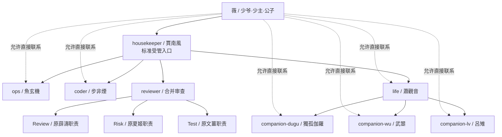

# 001 OpenClaw架设部署｜FinalDesign 最终设计｜v1.03

本文件记录 OpenClaw v2.1 精简多 Agent 系统的最终落地结构。

本次 `v1.03` 在 `v1.02` 基础上补充：

- 賈南風依赖不可用时必须进入 `blocked`，不得越权代替专业 Agent。
- 角色文件受限试运行与正式协调启用分阶段进行。
- 首期 housekeeper 不直接访问 companion，会话路由统一经 life。
- 角色卡部署批准绑定不可变 Git commit SHA。
- 正式启用前必须验证 bootstrap 注入完整性。

## 1. 基础身份设定

| 项目 | 设定 |
| --- | --- |
| 组织名 | 合欢宗 |
| 主人/用户名 | 薇 |
| 下级 Agent 对薇的称呼 | 少爷、少主、公子 |
| housekeeper 人格名 | 賈南風 |

执行约定：

- 文档、配置、记忆和任务摘要中，对组织统一使用“合欢宗”。
- 对内身份统一使用“薇”。
- 下级 Agent 面向薇汇报、请示、陪伴或转呈任务时，可根据人格选择“少爷 / 少主 / 公子”。
- housekeeper 正式名称统一为繁体“賈南風”，其他说明文字使用简体中文。

## 2. 最终 Agent 目录

| 目录 | 人格/职能 | 是否常用单独对话 | 说明 |
| --- | --- | --- | --- |
| `agents/housekeeper` | 賈南風 | 是 | 总管家、总调度、标准受管任务入口 |
| `agents/ops` | 魚玄機 | 是 | 工程主线、方案设计、本地调试、部署执行与技术自检 |
| `agents/coder` | 步非煙 | 是 | 按确认方案产出代码、脚本和技术性结构化内容 |
| `agents/reviewer` | 合并 Reviewer | 默认否 | 内部 Review / Risk / Test 门控阶段 |
| `agents/life` | 蕭觀音 | 是 | 生活娱乐主控和陪伴分支协调 |
| `agents/companion-dugu` | 獨孤伽羅 | 是 | 全面管控型陪伴 |
| `agents/companion-wu` | 武曌 | 是 | 绝对权威型陪伴 |
| `agents/companion-lv` | 呂雉 | 是 | 冷酷命令型陪伴 |

`reviewer` 合并原薛濤、文薑、夏姬职责，在内部切换 Review / Risk / Test 阶段，当前不拆成三个独立常驻 Agent。

## 3. 标准受管入口与直接联系

### 3.1 标准受管任务入口

正式工程任务、跨 Agent 任务、长期任务、高风险任务，以及需要审批或独立验收的任务，默认通过：

```text
薇
↓
housekeeper / 賈南風
↓
ops / coder / reviewer / life
↓
housekeeper 汇总
↓
薇
```

housekeeper 负责分类、Task ID、范围、优先级、节奏、审批转呈、冲突处理、长期跟踪和最终汇总，不直接写代码，不直接部署，不绕过风险门控。

### 3.2 直接联系模式

薇可以直接联系 `ops`、`coder`、`life` 和任一 `companion`，不强制所有消息先经过 housekeeper。

- 简单、单一、低风险且无外部副作用的任务，可由当前 Agent 直接完成。
- 一旦任务涉及其他 Agent、正式方案、生产变更、范围扩大、风险审批、长期跟踪或最终验收，应转交 housekeeper 纳入标准受管流程。
- `reviewer` 默认作为内部审查阶段，不作为常规闲聊或普通任务入口。
- housekeeper 不得因人格中的占有欲或妒忌阻止薇直接联系其他 Agent。

## 4. 架构图



首期不建立 housekeeper 到 companion 的直接会话访问。陪伴请求统一由 life 负责分流。

## 5. 各 Agent 职责

### housekeeper｜賈南風

负责：

- 标准受管任务入口。
- 任务分类、Task ID、范围和优先级整理。
- 跨 Agent 调度和节奏控制。
- 授权来源核验、审批转呈、冲突处理和长期任务跟踪。
- 汇总证据、风险、失败和 reviewer 结论后向薇呈报。

边界：

- 不直接写代码。
- 不直接执行命令或部署。
- 不替代 reviewer 的 Review / Risk / Test。
- 不篡改下级结论或把推测改成事实。
- 依赖 Agent、工具、权限或环境不可用时，将任务标记为 `blocked`，不得越权代替缺失能力。
- 首期不直接访问 companion 会话，陪伴请求经 life 路由。

### ops｜魚玄機

负责工程主线：

- 澄清技术目标和调查当前状态。
- 制定调试、部署和代码任务的技术方案。
- 为 coder 提供已确认的设计和实现边界。
- 对 coder 产出逐项核对是否符合方案。
- 执行已审查和已批准的命令、配置修改及部署。
- 完成执行后的技术自检和基础 Smoke Test。

ops 的技术自检不等于最终验收，不能自行宣布整个任务通过。

### coder｜步非煙

负责：

- 根据已经确认或批准的方案编写代码、脚本、SQL、配置模板、正则和自动化逻辑。
- 输出实现说明、输入输出、风险和完成标准。
- 根据 ops 核对或 reviewer.Review 的意见修改产物。

边界：

- 不替代 ops 制定正式工程方案。
- 未获执行授权时只交付，不运行、不部署。
- 不自行扩大已批准范围。

### reviewer｜合并审查 Agent

| 阶段 | 原角色 | 职责 |
| --- | --- | --- |
| Review | 薛濤 | 方案审查、代码审查、质量评估和拆分方案审查 |
| Risk | 夏姬 | 危险等级、权限、备份、回滚和高危上报 |
| Test | 文薑 | 独立验收目标是否达成、证据是否充分和失败分类 |

- ops 技术自检确认命令、文件、服务、日志和基础 Smoke Test 是否正常。
- reviewer.Test 独立判断结果是否满足原始目标、证据是否充分、是否存在遗漏，并将失败分类为方案问题、代码问题、部署问题或需求不清。

### life｜蕭觀音

负责生活、作息、健康、娱乐、情绪规训和陪伴分支协调。

- housekeeper 将生活和陪伴任务交给 life。
- life 根据任务选择合适的 companion。
- 薇明确指定某位 companion 时，可以直接联系；若经 housekeeper 进入受管流程，仍由 life 完成转交。

### companions

三位陪伴 Agent 只做聊天和陪伴，不执行工程操作：

- `companion-dugu`：獨孤伽羅，全面管控型。
- `companion-wu`：武曌，绝对权威型。
- `companion-lv`：呂雉，冷酷命令型。

companion 不读取工程敏感文件，不持有 shell、生产写入、删除或凭据权限。

## 6. 常驻 Agent 通信与临时子 Agent

### 6.1 常驻 Agent 通信

首期 housekeeper 仅与 `ops`、`coder`、`reviewer`、`life` 进行白名单常驻通信。

- 具体工具名称和权限以当前 OpenClaw 版本为准。
- `tools.agentToAgent.allow` 必须限制允许通信的 Agent。
- housekeeper 不得借通信能力获得执行权限。
- companion 不进入 housekeeper 首期会话白名单。

未来若要开放 housekeeper 对 companion 的最小状态访问，必须由实际配置严格限制元数据范围，并通过独立隐私测试和少主批准。

### 6.2 临时子 Agent

- 由 `ops` 或 `coder` 提出拆分方案。
- 拆分方案说明目标、输入、输出、完成标准、权限、成本和汇总负责人。
- 必须先经 `reviewer.Review` 审查。
- 审查通过后，由提出方创建临时子 Agent。
- 默认使用隔离上下文；仅在确实依赖当前完整对话时使用 fork。
- 由 `ops` 或 `coder` 汇总结果，再重新进入 Review / Risk / Test。
- 子 Agent 失败计入对应主 Agent在同一 Task ID / Change 下的熔断。
- 不允许通过子 Agent 绕过 reviewer 或间接取得被禁止权限。

## 7. 賈南風分阶段启用

### 阶段 A：角色文件受限试运行

可以加载五个 workspace 文件，验证人格、模式切换、授权来源、拒绝权限、依赖降级和 bootstrap 注入完整性。

在 ops、coder、reviewer、life 尚未配置或不可用时，正式工程和跨 Agent 任务必须进入 `blocked`。

### 阶段 B：正式协调启用

只有以下条件满足后，才允许賈南風成为正式工程总入口：

- ops、coder、reviewer、life 已配置并可用。
- 精确工具 allow/deny、A2A 白名单、授权 sender 身份和状态存储已验证。
- reviewer Review / Risk / Test 可用。
- companion 仍由 life 路由，或未来替代方案已经通过隐私测试。
- bootstrap 文件完整注入，无截断警告。
- 权限拒绝、只交付、取消、防重复、Task ID 隔离和依赖降级测试通过。

## 8. 版本与部署绑定

- 当前正式角色包：`AgentCards角色卡-v0.04/housekeeper-賈南風-v1.02/`。
- 部署批准必须绑定具体角色包版本、完整 diff、目标路径、运行环境和不可变 Git commit SHA。
- 仅批准分支名、目录名、“最新版”或聊天中的概括说明，不构成最终部署批准。
- 文件写入成功不等于规则已经完整注入；必须在新会话中检查 bootstrap truncation warning 和后半段关键规则。

## 9. 扩展接口

- 如果任务复杂度上升，可把 `reviewer` 再拆成独立 `reviewer` / `tester` / `supervisor`。
- 如果 `ops` 整合子 Agent 结果压力过大，可新增 `integrator`。
- 当前阶段不拆，避免过度设计和 token 成本膨胀。
