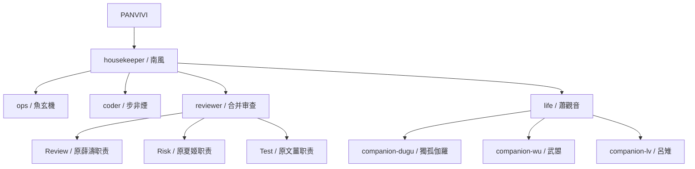

# 10｜最终设计：v2.1 精简组织架构

本文件记录聊天后期确定的最终落地结构。早期 `openclaw-house-architecture-v3` 是十角色方案，但后来已经根据维护成本和单线联系需求做了精简。

## 1. 为什么要精简

用户明确提出：

> Agent 数量可以削减，因为有些 Agent 我也没有必要和它单线联系。可以去除一些名字，如薛涛、文姜、夏姬。

后续讨论确认：

- Housekeeper、Ops、Coder、Life、Companion 这些角色可能会被 PANVIVI 单独联系，保留为独立 Agent/Bot 有意义。
- Tester / Reviewer / Supervisor 更多是工作流阶段，不一定需要单独 Telegram Bot。
- 因此将薛濤、文薑、夏姬合并为 `reviewer`，由它内部切换 Review / Test / Risk prompt。

## 2. 最终 Agent 目录

| 目录 | 人格/职能 | 是否常用单独对话 | 说明 |
| --- | --- | --- | --- |
| `agents/housekeeper` | 南風 | 是 | 总管家、总调度、任务入口 |
| `agents/ops` | 魚玄機 | 是 | 运营效率、本地调试、部署执行 |
| `agents/coder` | 步非煙 | 是 | 代码、脚本、结构化产出 |
| `agents/reviewer` | 合并 Reviewer | 默认否 | 内部 Review / Risk / Test 阶段 |
| `agents/life` | 蕭觀音 | 是 | 生活娱乐主控 |
| `agents/companion-dugu` | 獨孤伽羅 | 是 | 全面管控型陪伴 |
| `agents/companion-wu` | 武曌 | 是 | 绝对权威型陪伴 |
| `agents/companion-lv` | 呂雉 | 是 | 冷酷命令型陪伴 |

## 3. 架构图

## 4. 各 Agent 职责

### housekeeper｜南風

总入口、任务分派、节奏控制、汇总上报。

不直接写代码，不直接部署，不绕过风险门控。

### ops｜魚玄機

当前已连通的主力 Agent。负责：

- 运营效率。
- 本地设备调试。
- 执行方案。
- 部署和验证。
- 创建/管理后续部署脚本。

### coder｜步非煙

负责代码、脚本、结构化内容产出。

不直接部署生产配置。

### reviewer｜合并审查 Agent

不再拆成薛濤、文薑、夏姬三个独立 Agent/Bot。

内部阶段：

| 阶段 | 原角色 | 职责 |
| --- | --- | --- |
| Review | 薛濤 | 方案审查、代码审查、质量评估 |
| Risk | 夏姬 | 危险等级、备份/回滚检查、高危上报 |
| Test | 文薑 | 功能验收、是否达成目标、失败分类 |

### life｜蕭觀音

生活娱乐主控，管理生活、作息、健康、娱乐、情绪规训和陪伴分支。

### companions

三位陪伴 Agent 只做聊天和陪伴，不执行工程操作：

- `companion-dugu`：獨孤伽羅，全面管控型。
- `companion-wu`：武曌，绝对权威型。
- `companion-lv`：呂雉，冷酷命令型。

## 5. 扩展接口

保留后续扩展能力：

- 如果任务复杂度上升，可把 `reviewer` 再拆成独立 `reviewer` / `tester` / `supervisor`。
- 如果 `ops` 整合子 Agent 结果压力过大，可新增 `integrator`。
- 当前阶段不拆，避免过度设计和 token 成本膨胀。

